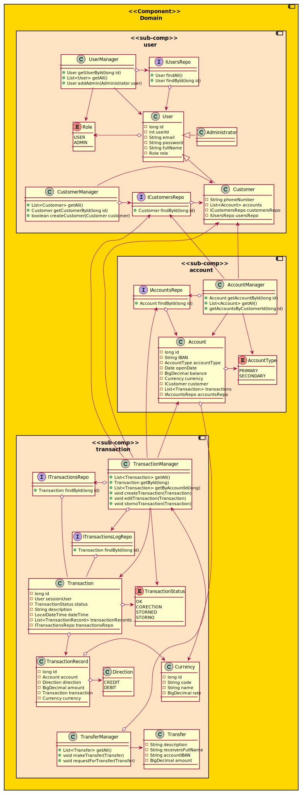

# Class and object diagrams

[Architecture overview](index.html)

* TOC
{:toc}

---

## Class diagrams

The system is too big to fit in one class diagram.

Class diagrams below provide an overview of classes under the respective components.

### Domain

### Integration

### Repository

## Object diagram

---

[Previous (Component diagram)](component.html)

[Next (Sequence diagram)](sequence.html)
