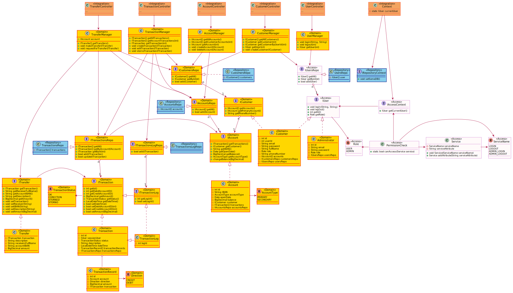

# Class and object diagrams

[Architecture overview](index.html)

* TOC
{:toc}

---

The application was developed according to the MVC software design pattern.

There are multiple GoF patterns implemented in the code. In the Access layer we used the Singleton pattern for holding the system's context. We designed the Repository layer to be fully interchangeable, for that we used a strategy pattern, so that domain classes would always use interfaces - not concrete implementations. And also for the same reason, we used factories, to allow us to build these different concrete implementation classes for the Repository layer.

## Class diagrams

That is how the initial class diagram looked like. The system is too big to fit in one class diagram, so it was split up further. Class diagrams below are up-to-date and provide an overview of classes under the previously mentioned components.

### Domain

Domain component classes are the core of the system. They are responsible for the business logic.

We have controller classes in the integration component, and manager classes in the domain component. Controllers are wrappers around managers to move business logic from the component.

To overengineer even more, we have two different classes to represent a single entity: transactions and transfers. Transfers are a simplified replacement of transactions for a customer, as they are not used to know a friend's IBAN numbers by heart.

### Integration

Integration component holds mostly controller classes which handles API logic and uses specific domain classes.

### Repository

Repository classes are based on Spring JPA, and also inherit from exposed Domain component’s interfaces. In this way we invert dependencies and ensure that the Domain component is not dependent on the Repository.

## Object diagram

---

[Previous (Component diagram)](component.html)

[Next (Sequence diagram)](sequence.html)
