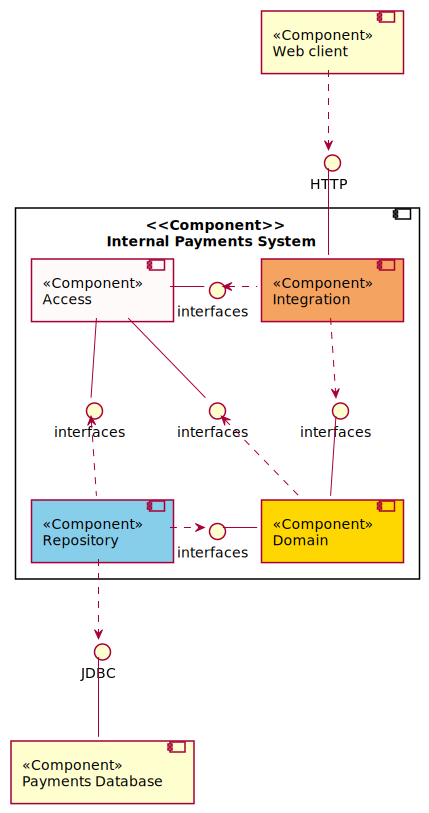

# Component diagram

[Architecture overview](index.html)

---

High-level component diagram provides an overview of a system components and interactions between them.

---

[Previous (Usecase diagram)](usecase.html)

[Next (Class and object diagrams)](class.html)
