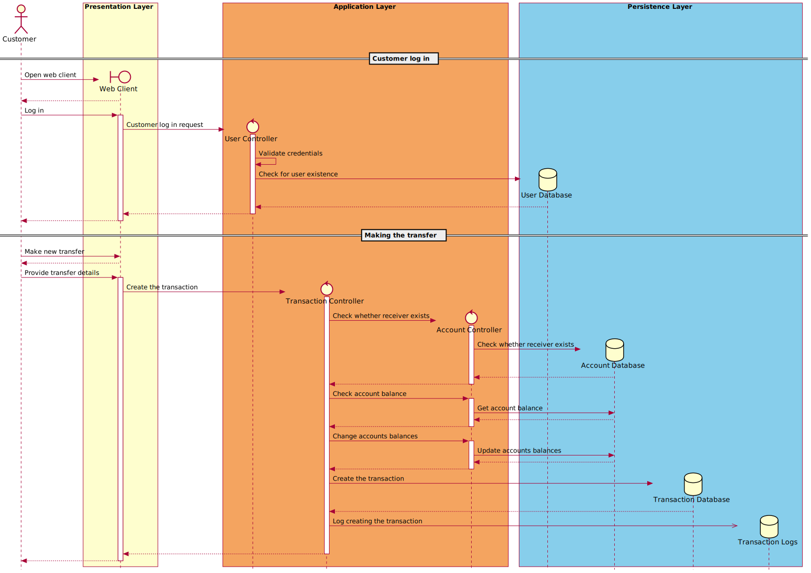
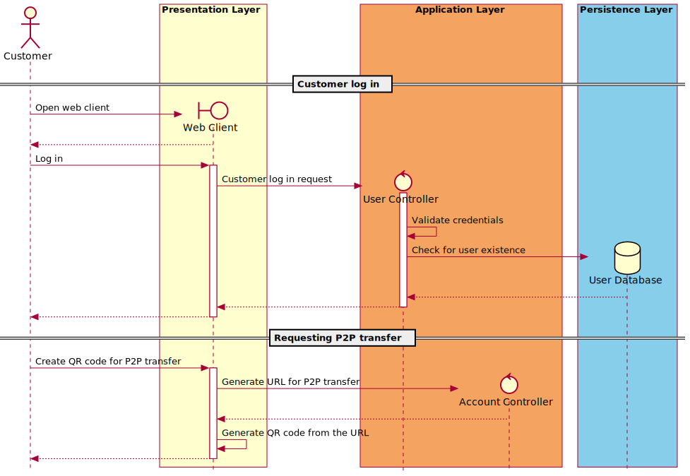
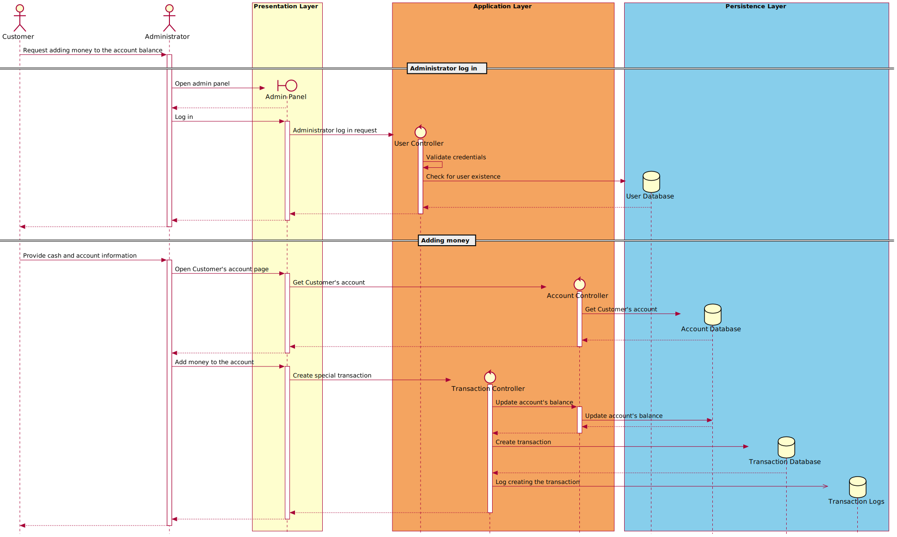
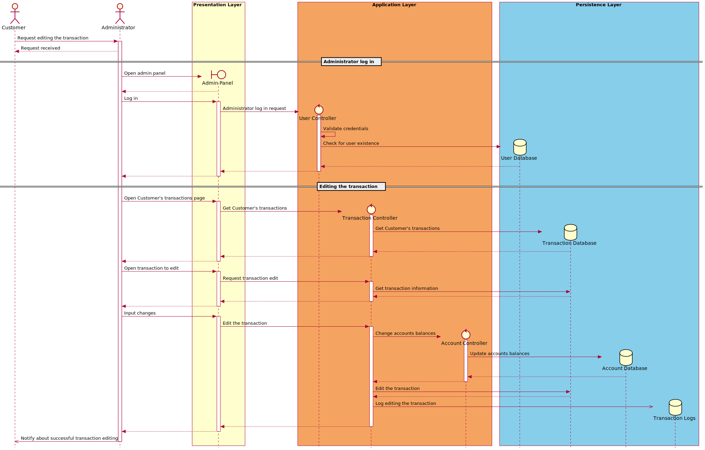
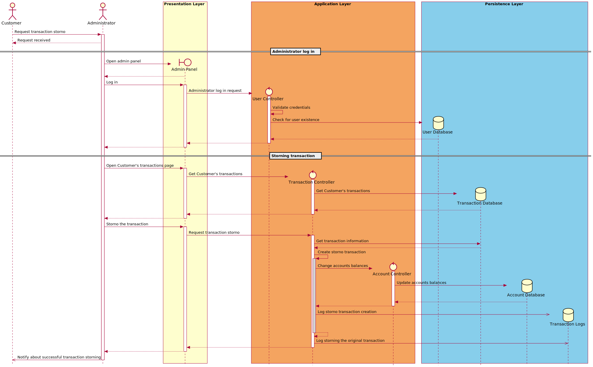

# Sequence diagrams

[Architecture overview](index.html)

* TOC
{:toc}

---

The following sequence diagrams explain the system's inner communication.

## Making transfer

## Requesting P2P transfer

## Adding money to the account

## Editing the transaction

## Storning the transaction

---

[Previous (Class and object diagrams)](class.html)

[Next (Usage manual)](../usage)
