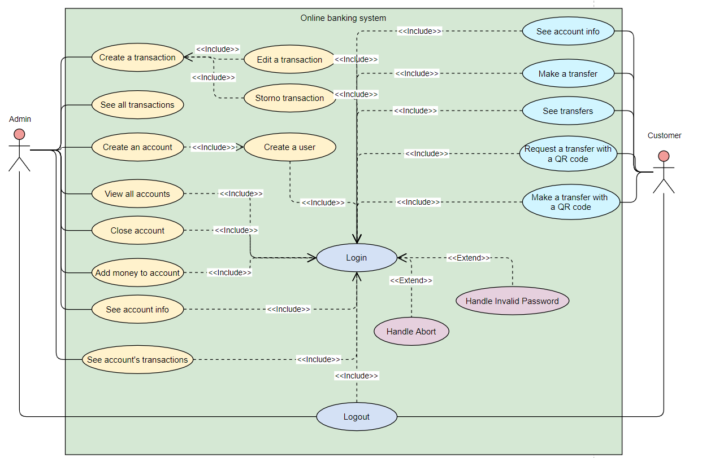

# Usecase diagram

[Architecture overview](index.html)

---

The stories can be grouped in a single usecase diagram.

---

[Previous (Stories)](stories.html)

[Next (Component diagram)](component.html)
