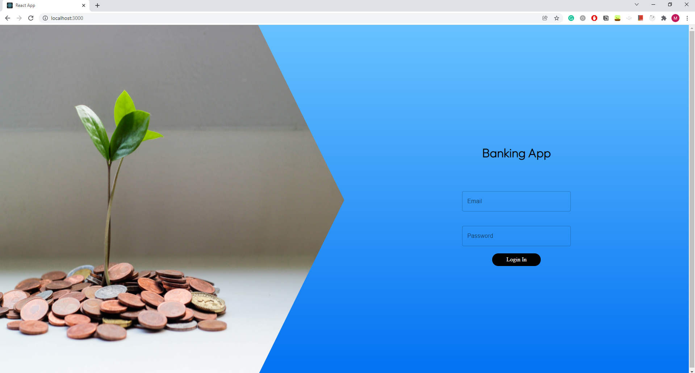
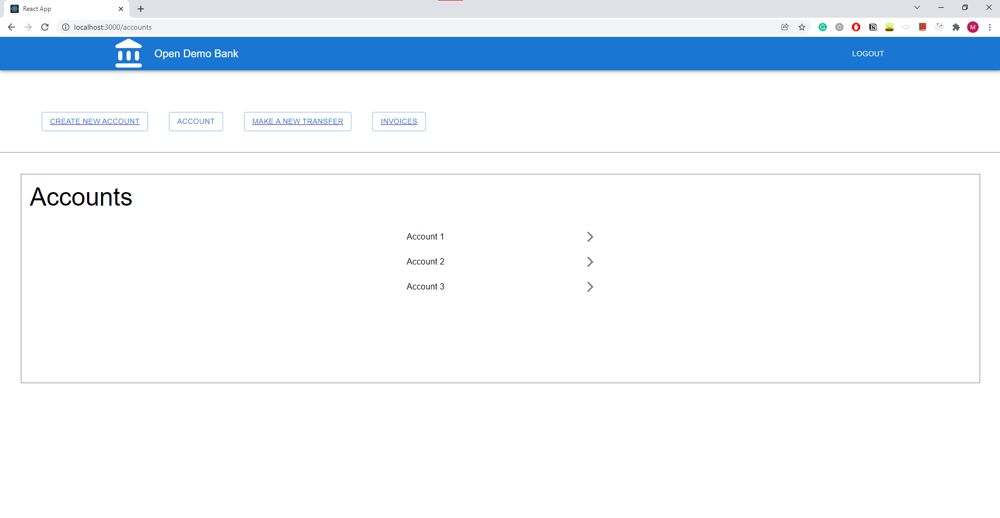
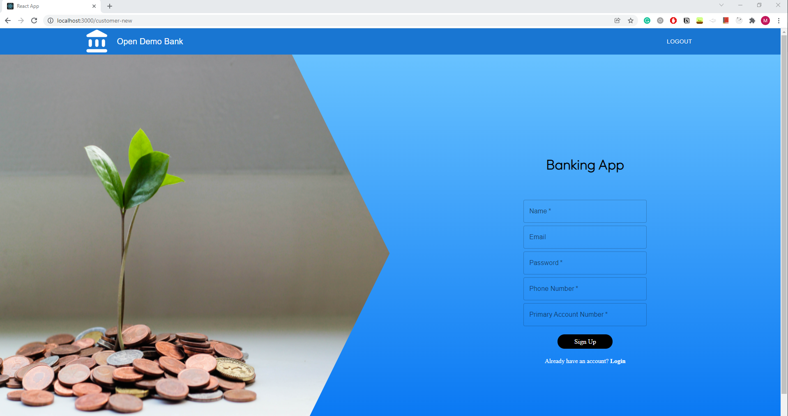
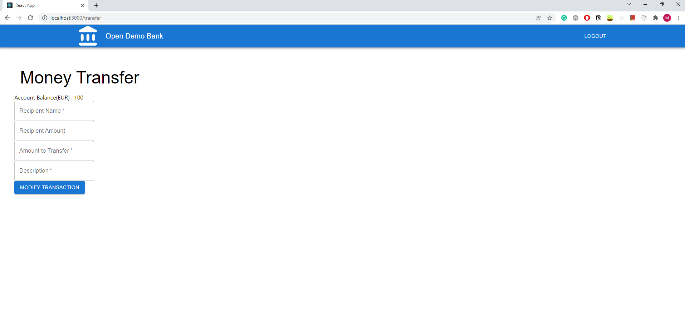
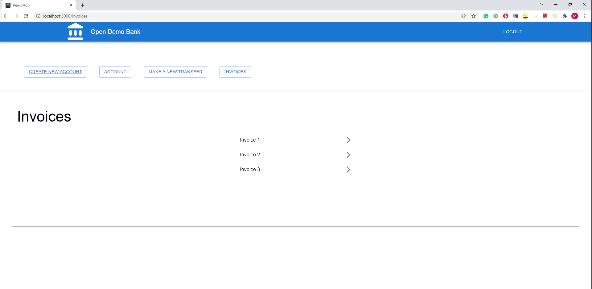
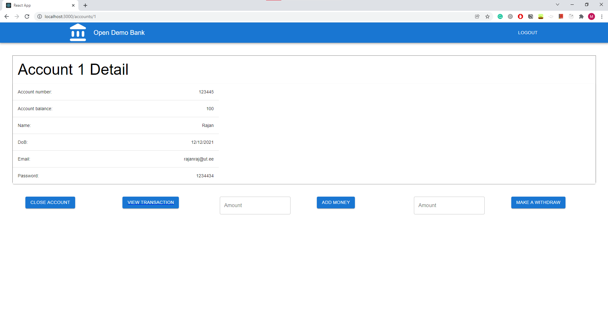
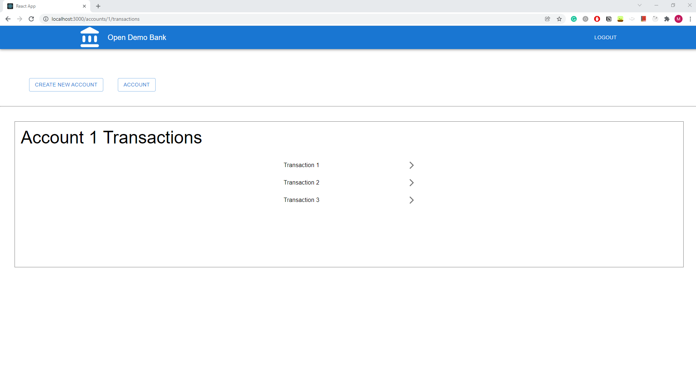
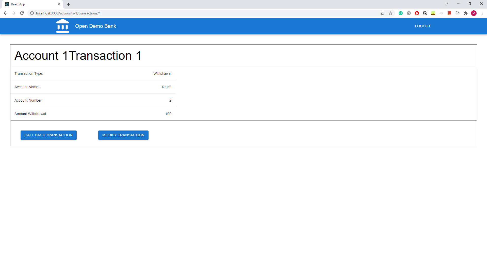

# Usage manual

[Main](/)

---

## Setup guide

1. Clone the repository with the following command: <br> 
```git clone https://github.com/opendemobank/web-client.git```
2. Run the following commands in git bash, in order to update npm and install react-scripts with it: <br> <br>
```npm install -g npm@latest``` <br>
```npm install react-scripts --save``` <br>
3. Now you have a login page at http://localhost:3000/ <br>
You can log in with the following test user <br><br>
**email:** admin@opendemobank.com<br>
**password:** admin<br>

---

### Login page



The login page is located at http://localhost:3000/. 
To continue, logging in is necessary.
**email:** admin@opendemobank.com<br>
**password:** admin<br>

### Account overview


After logging in, the admin is directed to the admin panel.
- If the admin clicks on 'create a new account', he is redirected to a new customer form.



- If the admin clicks on 'make a new transfer', he is redirected to a new transfer form.



- If the admin clicks on 'invoices', he is redirected to the invoice overview page.



- If the admin clicks on 'account 1', he is redirected to the detailed account information.



If the admin now clicks on 'view transaction', he will see this account's transactions.



When clicking on a specific transaction, the user will see detailed information about this transaction.



[Previous (Sequence diagrams)](../architecture/sequence.md)
