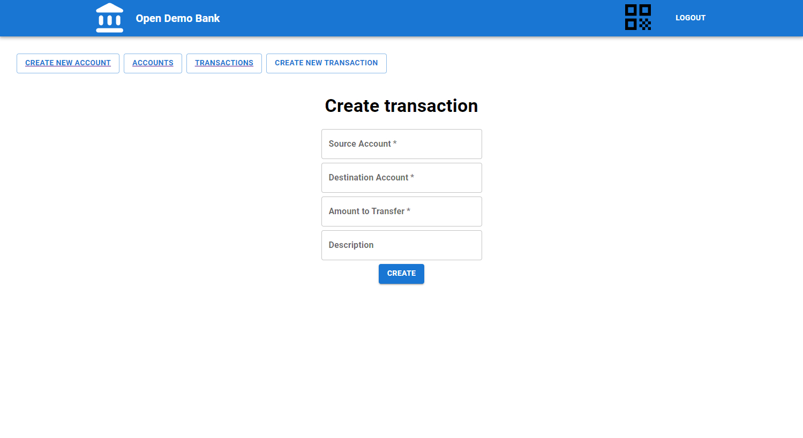

# Usage manual

[Main](/)

* TOC
{:toc}

---

## Setup guide

1. Clone the repository with the following command:
    ```bash
    git clone https://github.com/opendemobank/web-client.git
    ```
2. Run the following commands in git bash, in order to update npm and install react-scripts with it:
    ```
    npm install -g npm@latest
    npm install react-scripts --save
    ```
3. You can login at [http://localhost:3000/](http://localhost:3000/) with the following credentials:

    **email:** admin@opendemobank.com

    **password:** admin

---

## Usage

### Login page


The login page is located at [http://localhost:3000/](http://localhost:3000/). To continue, logging in is necessary.

**email:** admin@opendemobank.com

**password:** admin

### Account overview


After logging in, the admin is directed to the admin panel.

If the admin clicks on 'create new account', he is redirected to a new customer form.


If the admin clicks on 'create new transaction', he is redirected to a new transaction form.



If the admin clicks on 'transactions', he is redirected to the transaction overview page.


If the admin clicks on 'Account IBAN : EE801100000000000015', he is redirected to the detailed account information.


If the admin now clicks on 'view transactions', he will see this account's transactions.


When clicking on a specific transaction, the user will see detailed information about this transaction.


[Previous (Deployment diagram)](../architecture/deployment.md)
